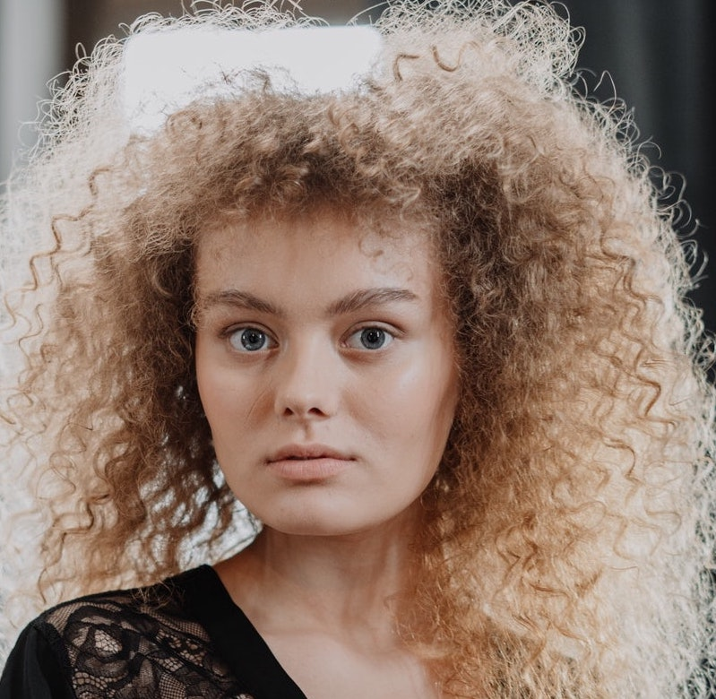
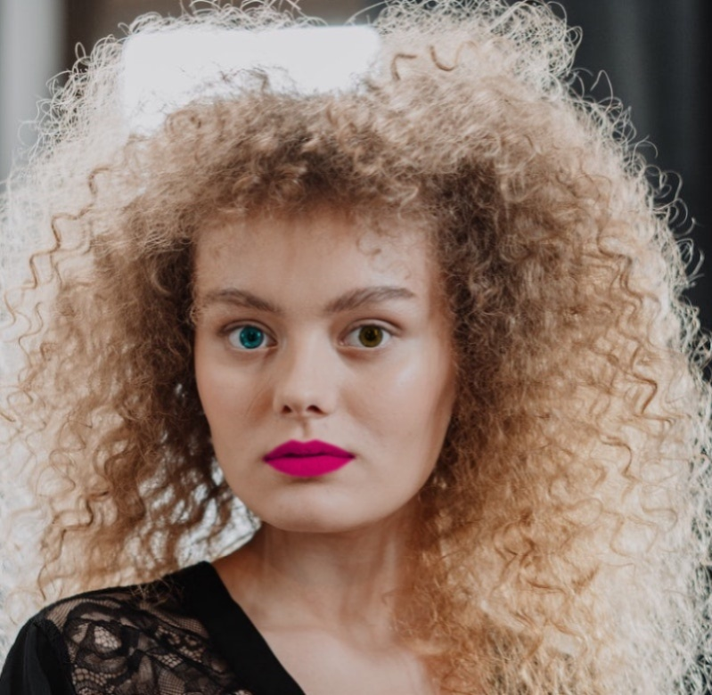

# basic_makeup
This repository is intented for the implementation of automated python scripts for applying basic makeup to images using computer vision tools.

# Description
This repository contains the implementation of the following makeup "filters":

1. im_lipstick
2. im_eyecolor

The scripts have been implemented using python, as part of the course Computer Vision II - Applications at opencv. The example images used in this repository are taken from the [lfw dataset](http://vis-www.cs.umass.edu/lfw/) and one image was provided by the course.

Both scripts display four outputs: the input image (original size), the gray-mask (scaled), the "colored" mask (scaled) and the output image (scaled) after applying the corresponding filter. However, the resulting image is saved to the same size as the input image.

# Pre-requisites
Before running the scripts, please make sure to install in advance the following:
- python version 3.8
- opencv
- dlib for machine learning

# Usage of automated lipstick
Navigate to the script directory and type in a terminal: `python im_lipstick.py -f path_to_file.jpg -a hue_value --saveIt`

## Explanation:
- -f refers to the full path of the image you want to apply lipstick.
- -a refers to the *hue* value. This parameter controls the color of the lipstick.
- --saveIt implies to save the image with the applied lipstick. Please omit this if you **do not** want to save the result.

This script provides a very basic way to apply lipstick to a given image. It uses the HSV color model to do that. If you are familiar with the RGB color model, then you can think of HSV as the "cylindrical coordinate system" for color, being RGB, the "cartesian coordinate system". **Hue** gives the "sense" of color in human vision. Further explanation about the HSV color model can be found in the [Wikipedia](https://en.wikipedia.org/wiki/HSL_and_HSV) and a good resource to find the actual value of *hue* for a desired lipstick color can be found [here](https://www.color-hex.com/).

One of the main limitations of this implementation is that it assumes the lips are closed in the input image. Therefore, it will fail to "nicely" apply the lipstick if the lips are wide open in the given image. Also, only the *hue* is used as input parameter for chosing color.

# Usage of automated eye-color
Navigate to the script directory and type in a terminal: `python im_eyecolor.py -f path_to_file.jpg -a hue left-iris -b hue right-iris --saveIt`

## Explanation:
- -f refers to the full path of the image you want to change the eyes color.
- -a refers to the *hue* value of the *left iris* of the face in the image. This parameter controls the color (see above).
- -b refers to the *hue* value of the *right iris* of the face in the image. This parameter controls the color (see above).
- --saveIt implies to save the image with the applied lipstick. Please omit this if you **do not** want to save the result.

In this case, the *hue* of each iris can be set independently (as in the example below). The main limitations of this implementation is that only the *hue* is the control parameter, therefore not all the aspects of the *color-space* are covered.

# Sample results
Input image                   |  Lipstick applied
:----------------------------:|:--------------------------------------:
  |  
Input image                   |  Eye-color applied
  |  
# TODOs
- Implement the case when the lips are not close to each other in the lipstick script.
- Implement additional *filters*: blush, hair color,...
